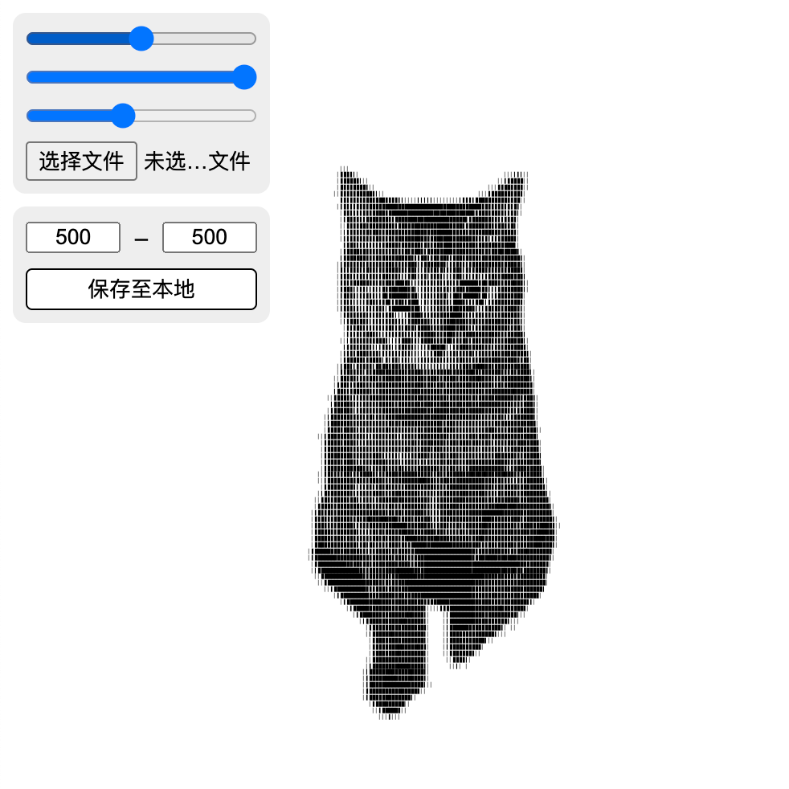

# ASCII 生成器 (image2ascii)

### 项目简介
这是一个使用 p5.js 库开发的 ASCII 艺术生成器。该工具将图像转换为由字符组成的艺术图像。这种风格的图像广泛应用于早期计算机图形和终端显示。

- 基于 [[原帖](https://x.com/colderoshay/status/1864718709031645580)] 的 ASCII 艺术生成器上修改调整

### Project Overview
This is an ASCII art generator developed using the p5.js library. The tool converts images into artwork made up of characters. This style of image was widely used in early computer graphics and terminal displays.

- Based on the ASCII art generator from [[original post](https://x.com/colderoshay/status/1864718709031645580)], with modifications and adjustments.